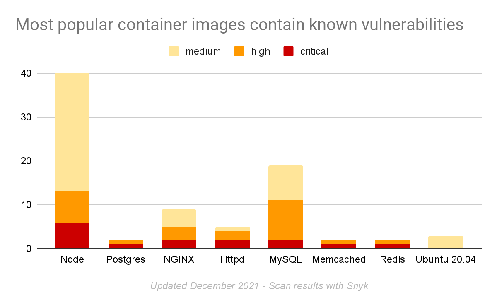
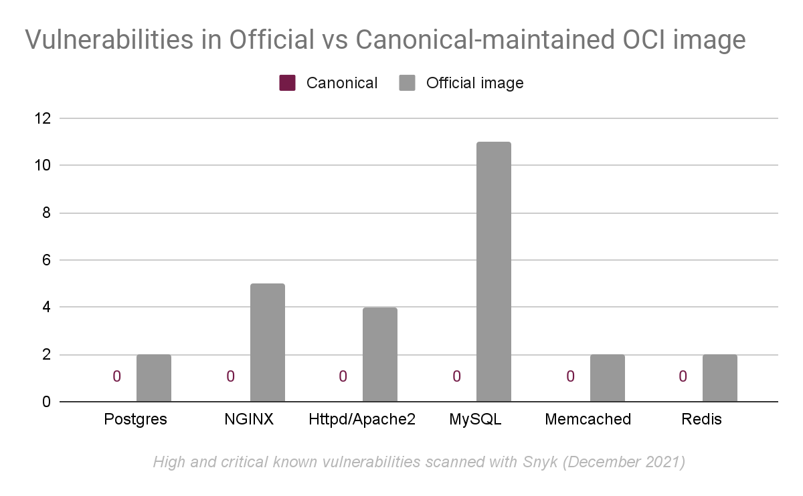

***********
Explanation
***********

Getting past the technical matters surrounding Rockcraft, from a higher perspective,
you might be asking *"but what is this after all?"* and *"why do I need it?"*.

Let's then use this page to go a bit deeper into the concepts and definitions behind Rockcraft.

What is a ROCK?
===============

Rockcraft builds ROCKs, but **what is a ROCK**?

In short, a ROCK is just an OCI-compliant container image! Period.

A ROCK can live on any existing container registry, very much like any other Docker image out there.
You can run a ROCK very much like any other container image...for example: ``docker run <rock> ...`` will work
just fine.

And the same applies to container image builds, in the sense that if you already have image build recipes (like Dockerfiles)
and you want to start basing your own images on an existing ROCK, that will work just fine too!

So why do I need ROCKs?
=======================

Now, this is the things get interesting. To answer this question, we first need to look at the current state of the art with respect to the existing container image offerings
out there.

It is easy to find public studies (like `Unit 42 / Znet <https://www.zdnet.com/article/96-of-third-party-container-applications-deployed-in-cloud-infrastructure-contain-known-vulnerabilities-unit-42/>`_
and `Snyk's state of open source security report 2020 <https://snyk.io/blog/10-docker-image-security-best-practices/>`_) where the findings
state a concerning number of containers at risk deployed in cloud infrastructures.

In fact, both these studies and our own assessments (dated from December 2021) show that the most popular images in Docker Hub
contain known vulnerabilities, with Ubuntu being the only one without any critical or high ones.

Sure, consumers could venture to fix these vulnerabilities themselves, but not only this would increase the cost and proliferation of images, but it wouldn't be
easy to accomplish due to the lack of expertise in the subject matter. The right approach is to actually fix the
vulnerabilities at their source! And Canonical has already started doing this. If we compare some of the Docker Official
container images vs some of the ones maintained by Canonical, we can verify that the latter have no high/critical vulnerabilities
in them!

So this is where the motivation for a new generation of OCI images (aka ROCKs) starts - the need for more secure container images!
And while this need might carry the biggest weight in the container users' demands, other values come into play when
selecting the best container image, such as:

 - stability
 - size
 - compliance
 - provenance

You can find these values and their relevance in this report: https://juju.is/cloud-native-kubernetes-usage-report-2021#selection-criteria-for-container-images.

This brings us to the problem statement behind ROCKs::

    How might we redesign secure container images for Kubernetes developers and application maintainers, considering the Top 10 Docker images are full of vulnerabilities, except Ubuntu?

A ROCK is:

 - **secure** and **stable**: based on the latest and greatest Ubuntu releases;
 - **OCI-compliant**: compatible with all the popular container management tools (Docker, Kubernetes, etc.);
 - **dependable**: built on top of Ubuntu, with a predictable release cadence and timely security updates;
 - **production-grade**: tested and secured by default.

Do I need to use Rockcraft?
===========================

If you want to build a proper ROCK, yes, we'd recommend you do. This is not to say you wouldn't be able to build ROCK-like container images
with your own tools, but Rockcraft has been developed precisely to offer an easy way to build production-grade container images.

Furthermore, Rockcraft is built on top of existing concepts and within the same family as `Snapcraft <https://snapcraft.io/docs/snapcraft-overview>`_
and `Charmcraft <https://juju.is/docs/sdk/charmcraft-cli-commands>`_, such that its adoption becomes seamless for those already used to building Snaps and Charms.
