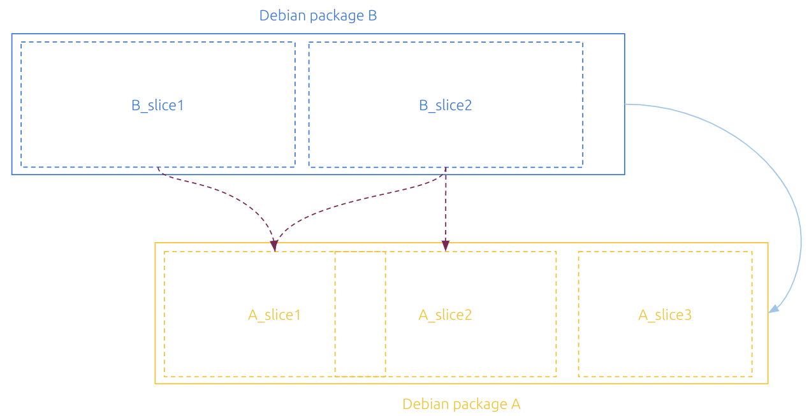

*********
Reference
*********


A Rockcraft project is defined in a YAML file named ``rockcraft.yaml``
at the root of the project tree in the filesystem.

This `Reference`_ section is for when you need to know which options can be used, and how, in this ``rockcraft.yaml`` file.


Format specification
--------------------

.. code-block:: yaml

  # The name of the ROCK.
  name: <name>

  # (Optional) The human-readable title of the ROCK. Defaults to name.
  title: <title>

  # Short summary describing the ROCK.
  summary: <summary>

  # Long multi-line description of the ROCK.
  description: |
    <description>

  # The ROCK version, used within the ROCK OCI tag.
  version: <version>

  # The system image and version the application will be layered on.
  base: ubuntu:18.04 | ubuntu:20.04 | ubuntu:22:04 | bare

  # (Optional) The system and version on top of which the application
  # will be built. Defaults to base.
  build-base: ubuntu:18.04 | ubuntu:20.04 | ubuntu:22:04

  # The license, in SPDX format, of the software packaged inside the ROCK.
  # This field is case insensitive.
  license: <license>

  # (Optional) The container entry point.
  entrypoint: [<path>, ...]

  # (Optional) The container command line, used as arguments for
  # entrypoint. If the entrypoint is not defined, the first item in
  # the cmd list the command to execute.
  cmd: [<arg>, ...]

  # (Optional) A list of keys and values defining the container's
  # runtime environment variables.
  env:
    - <var name>: <value>

  # List of architecture-specific ROCKs to be built.
  # Supported architectures are: amd64, arm64, arm, i386, ppc64le, riscv64 and s390x.
  platforms:
    # If matching a valid architecture name, it must be the same as "build-for".
    <entry>:
      # Host architectures where the ROCK can be built.
      # Required when "build-for" is specified, otherwise it defaults to <entry>
      build-on: [<arch>, ...]
      # (Optional) Target architecture the ROCK will be built for.
      # Defaults to <entry>.
      build-for: <arch>

  # The parts used to build the application.
  parts:
    <part name>:
      ...


Example
.......

.. code-block:: yaml

  name: hello
  title: Hello World
  summary: An Hello World ROCK
  description: |
    This is just an example of a Rockcraft project
    for an Hello World ROCK.
  version: latest
  base: bare
  build-base: ubuntu:22.04
  license: Apache-2.0
  entrypoint: [/usr/bin/hello, -t]
  env:
    - VAR1: value
    - VAR2: "other value"
  platforms:
    amd64:
    arm:
      build-on: ["arm", "arm64"]
    ibm:
      build-on: ["s390x"]
      build-for: s390x

  parts:
    hello:
      plugin: nil
      stage-packages:
        - hello

Rockcraft parts
---------------

.. rubric:: The main building blocks of a ROCK are *parts*.

If this sentence sounds familiar, it's because **it is familiar**!
Rockcraft parts are inherited from other existing Craft tools like `Snapcraft <https://github.com/snapcore/snapcraft>`_ and
`Charmcraft <https://github.com/canonical/charmcraft>`_.

Rockcraft *parts* go through the same lifecycle steps as Charmcraft and `Snapcraft parts <https://snapcraft.io/docs/parts-lifecycle>`_.

The way the *parts*' keys and values are used in the *rockcraft.yaml* is exactly the same
as in `*snapcraft.yaml* <https://snapcraft.io/docs/snapcraft-parts-metadata>`_ (`here <https://snapcraft.io/docs/adding-parts>`_ is
how you define a *part*).

Albeit being fundamentally identical to Snapcraft parts, Rockcraft parts actually offer some extended functionality and keywords:
- **stage-packages**: apart from offering the well-known package installation behavior, in Rockcraft the ```stage-packages``` keyword
actually supports chiseled packages as well (see below to know more about `Chisel`_).

 
Chisel
......

As the name says, Chisel is a tool for carving and cutting. But carving and cutting what? Even though we are talking about ROCKs, it's not
like these are actual solid masses one can physically interact with...

`Chisel <https://github.com/canonical/chisel>`_ is a software tool for carving and cutting **Debian packages**!

One of the key value propositions of Rockcraft is the ability to build truly minimal container images while honoring the Ubuntu experience.
Well, when having a closer look at a Debian package, it is easy to understand that this artifact is purely an archive that can be inspected, 
navigated and deconstructed. Having noted this, we've come up with the idea of **Package Slices** - minimal, complimentary and loosely coupled
sets of files, based on the package's metadata and content. Slices are basically subsets of the Debian packages, with their own content
and set of dependencies to other internal and external slices.

  |pic1|  ➜  |pic2|



.. |pic2| image:: _static/slice-of-ubuntu.png
  :width: 45%
  :alt: Debian package slices with dependencies

This image depicts a simple case, where both packages *A* and *B* are deconstructed into multiple slices. At a package level, *B* depends on *A*,
but in reality, there might be files in *A* which *B* doesn't actually need (eg. *A_slice3* isn't needed for *B* to function properly). With this
slice definition in place, Chisel is able to extract a highly-customized and specialized Slice of the Ubuntu distribution, which one could see
as a block of stone from which we can carve and extract small and relevant parts we need to run our applications. 
It is ideal to support the creation of smaller but equally functional container images.

    *“The sculpture is already complete within the marble block, before I start my work. It is already there, I just have to chisel away the superfluous material.”*
      \- Michelangelo

In the end, it's like having a slice of Ubuntu - *just what you need*.


